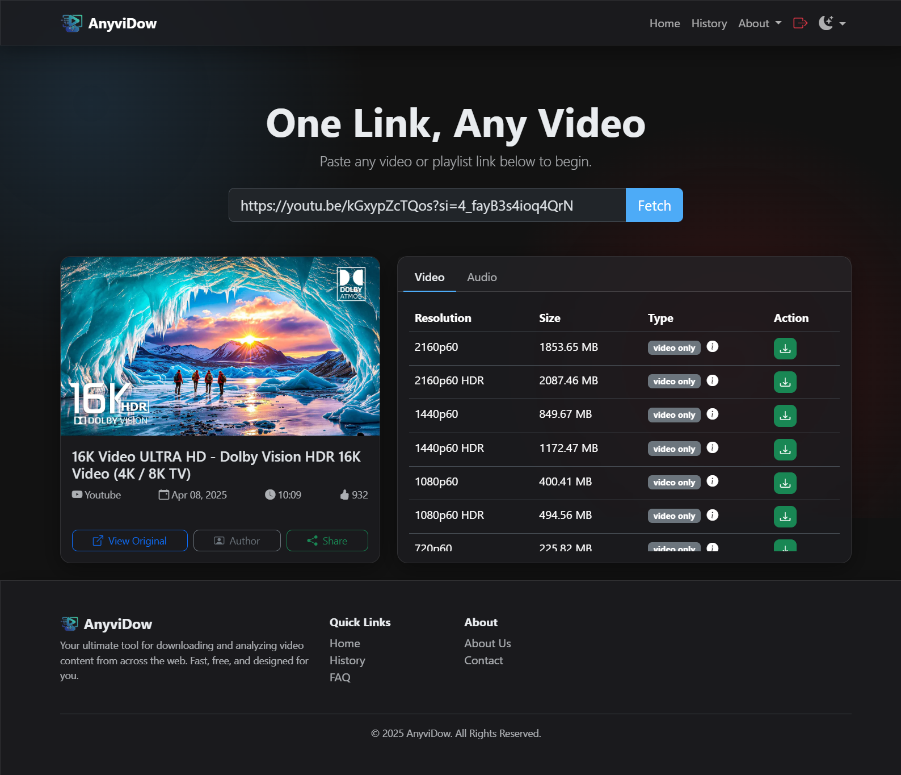
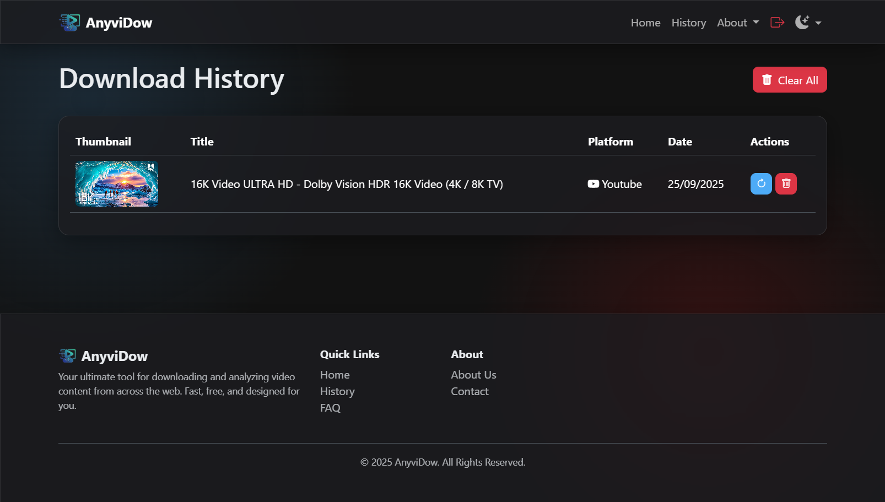
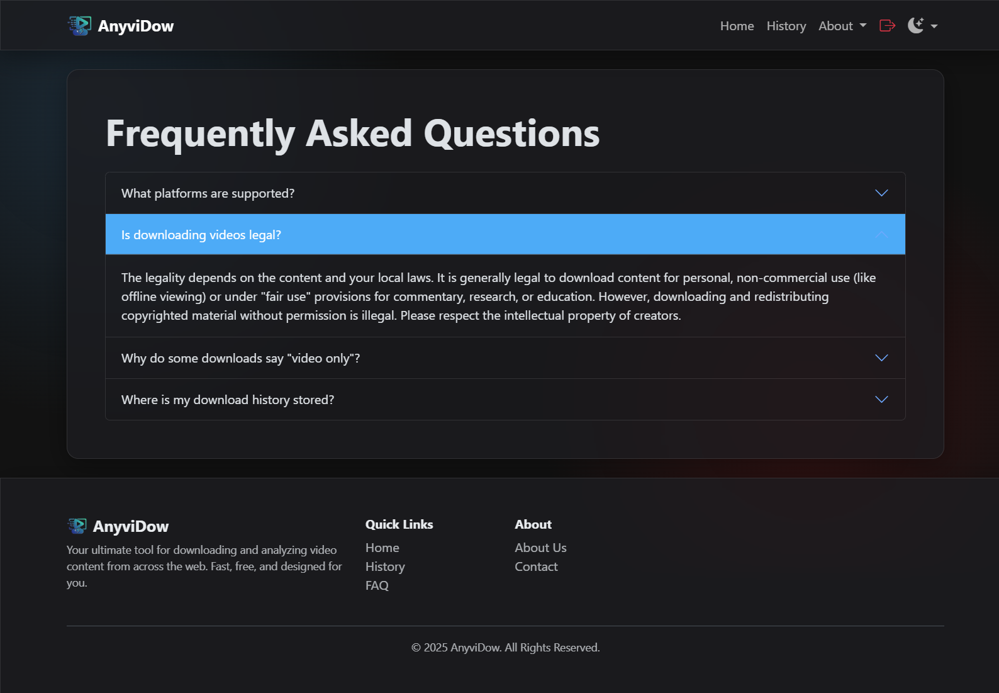
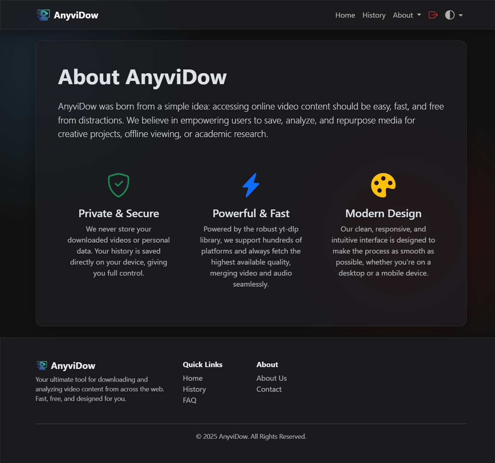
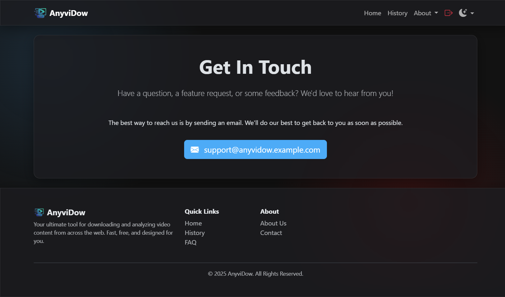
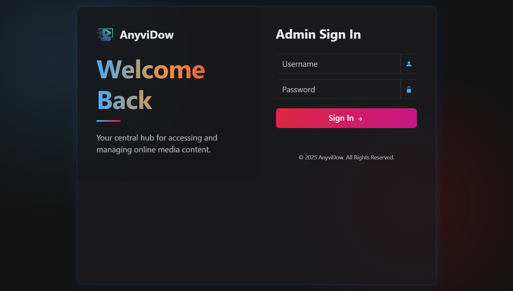

[](https://git.io/typing-svg)

[](https://python.org)
[](https://flask.palletsprojects.com)
[](LICENSE)
[]()

AnyviDow is a modern, feature-rich web application that lets you download videos and playlists from hundreds of websites including YouTube, Instagram, Facebook, X (Twitter), and many more. Built with privacy and user experience in mind.



## 📸 Screenshots

| Home Page | History Page | FAQ Page |
|-----------|--------------|----------|
|  |  |  |

| About Page | Contact Page | Sign In |
|------------|--------------|----------|
|  |  |  |

## ✨ Key Features

### 🎯 **Smart Download System**
- **Universal Link Support:** Paste any video or playlist URL - we'll handle the rest
- **Multiple Format Options:** Choose from various video qualities (144p to 8K) and audio formats
- **Intelligent Merging:** Automatic video+audio merging using FFmpeg for highest quality downloads
- **Playlist Support:** Download entire playlists with custom range selection (All, Top 5, Bottom 5, Custom Range)
- **Format Detection:** Automatic detection of best available formats with fallback options
- **Batch Processing:** Efficient handling of multiple video downloads in playlists

### 🚀 **Modern User Experience**
- **Real-time Progress Tracking:** Live download progress with speed, ETA, and file size monitoring
- **Server-Sent Events (SSE):** Real-time streaming updates without page refresh
- **Responsive Design:** Perfect experience on desktop, tablet, and mobile devices
- **Dark/Light Themes:** Automatic theme switching with system preference detection
- **Download History:** Local browser storage for privacy-focused history management
- **Video Preview:** Embedded video player for supported platforms
- **Download Cancellation:** Cancel downloads anytime with proper cleanup

### 🔒 **Privacy & Security**
- **Local History:** Download history stored only in your browser (localStorage)
- **Secure Authentication:** Admin login protection with session management
- **No Server Storage:** Files are temporarily stored and automatically cleaned up
- **Privacy-First Design:** No tracking, no data collection, no external analytics

### 🎨 **Advanced UI Features**
- **Glassmorphism Design:** Modern glass card interface with backdrop blur effects
- **Interactive Progress Modals:** Beautiful circular progress indicators with timeline visualization
- **Responsive Navigation:** Collapsible navigation with theme switcher and logout functionality
- **Toast Notifications:** Real-time feedback system with auto-dismiss
- **Loading Skeletons:** Smooth loading states while fetching video information
- **Animated Backgrounds:** Subtle gradient animations for enhanced visual appeal
- **Mobile-First Design:** Optimized for touch interfaces and small screens

## 🛠️ Technology Stack

### Backend Technologies
- **Python 3.7+** - Core programming language
- **Flask 2.0+** - Lightweight web framework
- **yt-dlp** - Video extraction and downloading engine
- **FFmpeg** - Video/audio processing and merging
- **Threading** - Concurrent download processing
- **Server-Sent Events** - Real-time progress streaming

### Frontend Technologies
- **HTML5** - Semantic markup with modern standards
- **CSS3** - Advanced styling with custom properties and animations
- **JavaScript (ES6+)** - Modern JavaScript with async/await, modules
- **Bootstrap 5.3+** - Responsive UI framework
- **Bootstrap Icons** - Comprehensive icon library

### Key Libraries & Dependencies
```python
Flask>=2.0.0          # Web framework
yt-dlp>=2023.1.6      # Video downloader
Werkzeug>=2.0.0       # WSGI utilities
```

### Architecture Features
- **MVC Pattern** - Clean separation of concerns
- **RESTful API** - Clean API endpoints for frontend communication
- **Event-Driven** - Real-time updates using Server-Sent Events
- **Responsive Design** - Mobile-first approach with progressive enhancement
- **Modular CSS** - Component-based styling with CSS custom properties

## 📋 Prerequisites

Ensure you have the following installed:

### Required Software
1. **Python 3.7+** - [Download from python.org](https://www.python.org/)
   - Verify installation: `python --version`
   - Ensure pip is included: `pip --version`

2. **FFmpeg** - [Download from ffmpeg.org](https://ffmpeg.org/download.html)
   - **Critical:** FFmpeg must be accessible from command line
   - Test installation: `ffmpeg -version`
   - **Windows:** Add FFmpeg to PATH environment variable
   - **macOS:** Install via Homebrew: `brew install ffmpeg`
   - **Linux:** Install via package manager: `sudo apt install ffmpeg`

### System Requirements
- **RAM:** Minimum 2GB (4GB+ recommended for large playlists)
- **Storage:** 1GB free space (more for temporary downloads)
- **Network:** Stable internet connection for video downloads
- **Browser:** Modern browser supporting ES6+ (Chrome 60+, Firefox 55+, Safari 12+)

### Optional Tools
- **Git** - For cloning the repository
- **Virtual Environment** - Recommended for Python dependency isolation

## 🚀 Quick Start

### Method 1: Standard Installation

#### 1. Clone Repository
```bash
git clone https://github.com/NikunjBaldaniya/AnyviDow.git
cd AnyviDow
```

#### 2. Setup Virtual Environment (Recommended)
```bash
# Create virtual environment
python -m venv venv

# Activate virtual environment
# Windows (Command Prompt)
venv\Scripts\activate

# Windows (PowerShell)
venv\Scripts\Activate.ps1

# macOS/Linux
source venv/bin/activate

# Verify activation (should show venv path)
which python
```

#### 3. Install Dependencies
```bash
# Upgrade pip first
pip install --upgrade pip

# Install project dependencies
pip install -r requirements.txt

# Verify installation
pip list
```

#### 4. Configure Application (Optional)
```bash
# Copy and edit configuration (if needed)
cp app.py app_config.py
# Edit app_config.py to change default credentials
```

#### 5. Run Application
```bash
# Development mode (with debug)
python app.py

# Production mode
FLASK_ENV=production python app.py
```

#### 6. Access Application
Open your browser and navigate to: **http://127.0.0.1:5000**

### Method 2: Docker Installation (Coming Soon)

```bash
# Build Docker image
docker build -t anyvidow .

# Run container
docker run -p 5000:5000 anyvidow
```

### Method 3: One-Line Installation Script

```bash
# Linux/macOS
curl -sSL https://raw.githubusercontent.com/NikunjBaldaniya/AnyviDow/main/install.sh | bash

# Windows (PowerShell)
iwr -useb https://raw.githubusercontent.com/NikunjBaldaniya/AnyviDow/main/install.ps1 | iex
```

## 🔐 Authentication & Security

### Default Credentials
- **Username:** `admin`
- **Password:** `password`

> ⚠️ **Security Warning:** Change default credentials before production deployment!

### Changing Default Credentials

#### Method 1: Edit app.py directly
```python
# In app.py, modify these lines:
ADMIN_USERNAME = 'your_new_username'
ADMIN_PASSWORD = 'your_secure_password'
app.config['SECRET_KEY'] = 'your-very-secret-and-random-key-12345'
```

#### Method 2: Environment Variables (Recommended)
```bash
# Set environment variables
export ADMIN_USERNAME="your_username"
export ADMIN_PASSWORD="your_password"
export SECRET_KEY="your-secret-key"

# Windows
set ADMIN_USERNAME=your_username
set ADMIN_PASSWORD=your_password
set SECRET_KEY=your-secret-key
```

### Security Features
- **Session Management:** Secure Flask sessions with configurable secret key
- **Route Protection:** All routes except login require authentication
- **CSRF Protection:** Built-in protection against cross-site request forgery
- **File Cleanup:** Automatic cleanup of downloaded files after serving
- **No Data Persistence:** No user data stored on server
- **Local Storage Only:** Download history stored in browser localStorage

## 📱 How to Use

### Single Video Download
1. **Login** with admin credentials at `/login`
2. **Paste** video URL in the input field (supports 1000+ websites)
3. **Click Fetch** to analyze the video and extract available formats
4. **Preview Video** (optional) - Click thumbnail to watch in embedded player
5. **Choose Format** from available options:
   - **Video Formats:** Various resolutions (144p to 8K) with quality indicators
   - **Audio Formats:** Different bitrates and formats (MP3, M4A, etc.)
   - **Combined Formats:** Video+Audio in single file
6. **Download** with real-time progress tracking showing:
   - Download speed and ETA
   - File size and progress percentage
   - Current phase (Video/Audio/Merging)

### Playlist Download
1. **Paste** playlist URL (YouTube, Dailymotion, etc.)
2. **Review Playlist** information:
   - Total video count and duration
   - Individual video previews
   - Creator information
3. **Select Quality** preference:
   - 1080p (Full HD)
   - 720p (HD)
   - 480p (SD)
   - 360p (Mobile)
4. **Choose Download Range:**
   - **All Videos:** Download entire playlist
   - **Top 5:** First 5 videos
   - **Bottom 5:** Last 5 videos
   - **Custom Range:** Specify start and end positions
5. **Download** as single ZIP file with progress tracking

### Advanced Features

#### Video Preview
- Click on video thumbnail to preview in embedded player
- Supports YouTube, Dailymotion, and other embeddable platforms
- Full-screen viewing available

#### Download History
- Access via **History** page in navigation
- View previously downloaded videos with thumbnails
- **Re-download** feature for quick access
- **Delete** individual items or clear entire history
- Search and filter capabilities

#### Progress Monitoring
- **Real-time Updates:** Live progress without page refresh
- **Detailed Statistics:** Speed, file size, ETA, current phase
- **Visual Indicators:** Circular progress bars and timeline
- **Cancel Anytime:** Stop downloads with proper cleanup

#### Theme Customization
- **Light Mode:** Clean, bright interface
- **Dark Mode:** Easy on the eyes for low-light usage
- **Auto Mode:** Follows system preference
- **Instant Switching:** No page reload required

## 🎯 Advanced Features

### Real-time Progress System
- **Server-Sent Events (SSE):** Live streaming updates without polling
- **Multi-phase Tracking:** Separate progress for video, audio, and merging phases
- **Detailed Metrics:**
  - Download speed (MB/s)
  - File size (current/total)
  - Estimated time remaining
  - Completion percentage
- **Visual Timeline:** Step-by-step progress visualization
- **Graceful Cancellation:** Clean termination with file cleanup

### Intelligent Download Engine
- **Format Selection Algorithm:** Automatic best quality detection
- **Fallback Mechanisms:** Multiple format options if primary fails
- **FFmpeg Integration:** 
  - Primary strategy: Copy video stream, encode audio to AAC
  - Fallback strategy: Re-encode both streams for compatibility
- **Error Handling:** Robust error recovery and user feedback
- **Memory Management:** Efficient handling of large files

### History & Data Management
- **Local Storage API:** Client-side data persistence
- **Privacy-First:** No server-side data collection
- **Smart Deduplication:** Prevents duplicate entries
- **Automatic Limits:** Configurable history size (default: 50 items)
- **Export/Import:** Backup and restore history data
- **Search Functionality:** Filter by title, platform, or date

### Cross-Platform Compatibility
- **Responsive Breakpoints:**
  - Mobile: < 576px (optimized touch interface)
  - Tablet: 576px - 768px (hybrid layout)
  - Desktop: > 768px (full feature set)
- **Progressive Enhancement:** Core functionality works without JavaScript
- **Browser Support:**
  - Chrome 60+ (full features)
  - Firefox 55+ (full features)
  - Safari 12+ (full features)
  - Edge 79+ (full features)

### Performance Optimizations
- **Lazy Loading:** Progressive content loading
- **CSS Animations:** Hardware-accelerated transitions
- **Efficient DOM Updates:** Minimal reflows and repaints
- **Memory Management:** Automatic cleanup of event listeners
- **Caching Strategy:** Smart asset caching for faster loads

### Accessibility Features
- **ARIA Labels:** Screen reader compatibility
- **Keyboard Navigation:** Full keyboard accessibility
- **High Contrast:** Support for high contrast modes
- **Reduced Motion:** Respects user motion preferences
- **Focus Management:** Proper focus handling in modals

## 📁 Project Structure

```
AnyviDow/
├── 📄 app.py                    # Main Flask application (1,200+ lines)
├── 📄 requirements.txt          # Python dependencies
├── 📄 README.md                 # Project documentation
├── 📁 static/                   # Static assets
│   ├── 🎨 style.css           # Custom styles (2,000+ lines)
│   ├── ⚡ script.js            # Frontend JavaScript (1,500+ lines)
│   └── 🖼️ logo.png             # Application logo
├── 📁 templates/               # Jinja2 templates
│   ├── 🏗️ layout.html          # Base template with navigation
│   ├── 🏠 index.html           # Home page with download interface
│   ├── 📚 history.html         # Download history management
│   ├── ℹ️ about.html           # About page
│   ├── ❓ faq.html             # Frequently asked questions
│   ├── 📧 contact.html         # Contact and feedback form
│   ├── 🔒 policy.html          # Privacy policy
│   ├── 📜 terms.html           # Terms of service
│   └── 🔐 login.html           # Authentication page
├── 📁 downloads/               # Temporary download storage
│   └── 🗂️ [session-folders]    # Auto-generated download folders
└── 📁 Screenshorts/           # Application screenshots
    ├── 🖼️ home_page.png
    ├── 🖼️ history_page.png
    ├── 🖼️ about_page.png
    ├── 🖼️ contact_page.png
    ├── 🖼️ faq_page.png
    ├── 🖼️ play_video.png
    └── 🖼️ sign_in_page.png
```

### Key Components

#### Backend (`app.py`)
- **Flask Application Setup:** Configuration, middleware, authentication
- **Helper Functions:** Video info extraction, format processing, file operations
- **API Endpoints:** RESTful routes for video/playlist processing
- **SSE Streaming:** Real-time progress updates
- **File Management:** Temporary storage and cleanup

#### Frontend (`static/`)
- **CSS Architecture:** Component-based styling with CSS custom properties
- **JavaScript Modules:** Event-driven architecture with state management
- **Responsive Design:** Mobile-first approach with progressive enhancement

#### Templates (`templates/`)
- **Jinja2 Templating:** Server-side rendering with template inheritance
- **Component Structure:** Reusable UI components and layouts
- **SEO Optimization:** Semantic HTML with proper meta tags

## 🔧 Configuration & Customization

### Environment Variables
```bash
# Production Configuration
export FLASK_ENV=production
export ADMIN_USERNAME=your_username
export ADMIN_PASSWORD=your_secure_password
export SECRET_KEY=your-very-long-random-secret-key
export DOWNLOAD_FOLDER=/path/to/downloads
export MAX_CONTENT_LENGTH=1073741824  # 1GB max file size
```

### Application Settings
```python
# In app.py - Core Configuration
DOWNLOAD_FOLDER = os.path.join(os.getcwd(), 'downloads')
app.config['SECRET_KEY'] = 'your-very-secret-and-random-key-12345'
ADMIN_USERNAME = 'admin'
ADMIN_PASSWORD = 'password'

# Advanced Configuration Options
app.config.update(
    MAX_CONTENT_LENGTH=16 * 1024 * 1024,  # 16MB max upload
    PERMANENT_SESSION_LIFETIME=timedelta(hours=24),
    SESSION_COOKIE_SECURE=True,  # HTTPS only
    SESSION_COOKIE_HTTPONLY=True,  # No JS access
    SESSION_COOKIE_SAMESITE='Lax'
)
```

### Theme Customization
```css
/* In static/style.css - CSS Custom Properties */
:root {
  --primary-color: #1072c8;      /* Main brand color */
  --secondary-color: #00BFA5;    /* Accent color */
  --glass-bg: rgba(255, 255, 255, 0.9);  /* Glass effect */
  --card-shadow: 0 8px 32px 0 rgba(16, 114, 200, 0.1);
}

/* Dark theme overrides */
[data-bs-theme="dark"] {
  --primary-color: #1072c8;
  --secondary-color: #00BFA5;
  --glass-bg: rgba(0, 0, 0, 0.8);
}
```

### Feature Toggles
```python
# In app.py - Feature Configuration
FEATURE_FLAGS = {
    'ENABLE_PLAYLIST_DOWNLOAD': True,
    'ENABLE_VIDEO_PREVIEW': True,
    'ENABLE_DOWNLOAD_HISTORY': True,
    'ENABLE_PROGRESS_TRACKING': True,
    'MAX_PLAYLIST_SIZE': 100,
    'MAX_HISTORY_ITEMS': 50,
    'AUTO_CLEANUP_HOURS': 24
}
```

### Branding Customization
```html
<!-- In templates/layout.html -->
<title>Your App Name</title>
<link rel="icon" type="image/png" href="{{ url_for('static', filename='your-logo.png') }}">

<!-- Update navigation brand -->
<a class="navbar-brand" href="/">
    
    <span class="fw-bold">Your App Name</span>
</a>
```

### Performance Tuning
```python
# In app.py - Performance Settings
import logging

# Logging configuration
logging.basicConfig(
    level=logging.INFO,
    format='%(asctime)s - %(name)s - %(levelname)s - %(message)s',
    handlers=[
        logging.FileHandler('app.log'),
        logging.StreamHandler()
    ]
)

# Threading configuration for downloads
MAX_CONCURRENT_DOWNLOADS = 3
DOWNLOAD_TIMEOUT = 300  # 5 minutes
```

## 🌐 Supported Platforms

AnyviDow supports **1000+ websites** through yt-dlp integration, including:

### 🎥 Video Platforms
- **YouTube** - Videos, playlists, live streams, YouTube Music
- **Vimeo** - Public and private videos, albums
- **Dailymotion** - Videos and playlists
- **Twitch** - VODs, clips, highlights
- **Facebook** - Public videos and live streams
- **Instagram** - Videos, IGTV, Reels, Stories

### 📱 Social Media
- **X (Twitter)** - Video tweets and threads
- **TikTok** - Short videos and user profiles
- **Reddit** - Video posts and comments
- **LinkedIn** - Professional videos
- **Snapchat** - Public stories and spotlights

### 🌍 International Platforms
- **Bilibili** - Chinese video platform
- **Niconico** - Japanese video sharing
- **VK** - Russian social network videos
- **Weibo** - Chinese microblogging videos
- **Douyin** - Chinese TikTok equivalent

### 📺 Streaming & TV
- **BBC iPlayer** - UK public broadcaster
- **Arte** - European cultural channel
- **CNN** - News videos and live streams
- **ESPN** - Sports highlights and clips
- **National Geographic** - Documentary content

### 🎓 Educational
- **Khan Academy** - Educational videos
- **Coursera** - Course videos (public)
- **edX** - Educational content
- **TED Talks** - Conference presentations

### 🎵 Music Platforms
- **SoundCloud** - Audio tracks and playlists
- **Bandcamp** - Artist music and albums
- **Mixcloud** - DJ mixes and radio shows

### Platform-Specific Features
| Platform | Video Quality | Audio Quality | Playlists | Live Streams |
|----------|---------------|---------------|-----------|-------------|
| YouTube | Up to 8K | Up to 320kbps | ✅ | ✅ |
| Vimeo | Up to 4K | Up to 256kbps | ✅ | ❌ |
| Instagram | Up to 1080p | Up to 128kbps | ❌ | ✅ |
| TikTok | Up to 1080p | Up to 128kbps | ❌ | ❌ |
| Twitch | Up to 1080p60 | Up to 160kbps | ❌ | ✅ |

> **Note:** Platform support and available qualities may vary based on content restrictions and yt-dlp updates.

## 📄 Legal & Privacy

### 🔒 Privacy Commitment
- **Zero Data Collection:** No personal information stored on servers
- **Local Storage Only:** Download history stored in browser localStorage
- **No Tracking:** No analytics, cookies, or third-party trackers
- **Temporary Files:** All downloads automatically cleaned up after serving
- **Session Security:** Secure session management with configurable timeouts

### ⚖️ Legal Compliance
- **Fair Use:** Designed for personal, educational, and fair use purposes
- **Copyright Respect:** Users responsible for compliance with copyright laws
- **Terms of Service:** Clear usage guidelines and restrictions
- **DMCA Compliance:** Proper procedures for copyright concerns
- **Age Restrictions:** Appropriate content filtering recommendations

### 📋 Documentation
- **Privacy Policy:** Complete data protection information (`/policy`)
- **Terms of Service:** Usage guidelines and restrictions (`/terms`)
- **FAQ:** Comprehensive user guide (`/faq`)
- **Contact:** Support and feedback channels (`/contact`)

### 🛡️ Security Measures
- **Input Validation:** Sanitized URL processing
- **File Security:** Safe filename generation and storage
- **Session Protection:** CSRF and session hijacking prevention
- **Error Handling:** Secure error messages without information disclosure

### 🌍 Compliance Standards
- **GDPR Ready:** European data protection compliance
- **CCPA Compatible:** California privacy rights support
- **Accessibility:** WCAG 2.1 AA compliance efforts
- **Security:** OWASP security best practices

## 🤝 Contributing

We welcome contributions from the community! Here's how you can help make AnyviDow better:

### 🐛 Bug Reports
1. **Check Existing Issues:** Search for similar problems first
2. **Provide Details:** Include steps to reproduce, expected vs actual behavior
3. **System Information:** OS, Python version, browser details
4. **Screenshots:** Visual evidence helps diagnose UI issues

### 💡 Feature Requests
1. **Describe the Feature:** Clear explanation of proposed functionality
2. **Use Cases:** Real-world scenarios where this would be helpful
3. **Implementation Ideas:** Technical suggestions if you have them
4. **Mockups:** Visual representations for UI changes

### 🔧 Code Contributions

#### Development Setup
```bash
# Fork and clone the repository
git clone https://github.com/yourusername/AnyviDow.git
cd AnyviDow

# Create development branch
git checkout -b feature/your-feature-name

# Setup development environment
python -m venv venv
source venv/bin/activate  # or venv\Scripts\activate on Windows
pip install -r requirements.txt

# Install development dependencies
pip install pytest black flake8 mypy
```

#### Code Standards
- **Python:** Follow PEP 8 style guide
- **JavaScript:** Use ES6+ features, consistent formatting
- **CSS:** Use BEM methodology, maintain custom property system
- **HTML:** Semantic markup, accessibility considerations

#### Testing
```bash
# Run tests
pytest tests/

# Code formatting
black app.py

# Linting
flake8 app.py

# Type checking
mypy app.py
```

#### Pull Request Process
1. **Create Feature Branch:** `git checkout -b feature/amazing-feature`
2. **Make Changes:** Implement your feature with tests
3. **Test Thoroughly:** Ensure all tests pass
4. **Update Documentation:** README, docstrings, comments
5. **Submit PR:** Clear title and description of changes

### 📚 Documentation
- **Code Comments:** Explain complex logic and algorithms
- **Docstrings:** Document all functions and classes
- **README Updates:** Keep installation and usage instructions current
- **API Documentation:** Document all endpoints and parameters

### 🎨 Design Contributions
- **UI/UX Improvements:** Better user experience suggestions
- **Accessibility:** Screen reader compatibility, keyboard navigation
- **Mobile Optimization:** Touch-friendly interface improvements
- **Theme Enhancements:** New color schemes or visual improvements

### 🌐 Localization
- **Translations:** Help translate the interface to other languages
- **Cultural Adaptations:** Region-specific features and improvements
- **RTL Support:** Right-to-left language support

### 💬 Community Guidelines
- **Be Respectful:** Treat all contributors with respect and kindness
- **Be Constructive:** Provide helpful feedback and suggestions
- **Be Patient:** Remember that everyone is learning and contributing their time
- **Follow Code of Conduct:** Maintain a welcoming environment for all

### 🏆 Recognition
Contributors will be recognized in:
- **Contributors List:** GitHub contributors page
- **Release Notes:** Major contributions highlighted in releases
- **About Page:** Special thanks section for significant contributors

## 📞 Support & Community

### 🆘 Getting Help

#### Self-Service Resources
1. **📖 FAQ Page:** Check `/faq` for common questions and solutions
2. **📋 Documentation:** This README covers most setup and usage scenarios
3. **🔍 Search Issues:** Look through existing GitHub issues for similar problems

#### Direct Support Channels
1. **📧 Contact Form:** Use the in-app contact form at `/contact`
2. **🐛 GitHub Issues:** Report bugs and request features
3. **💬 Discussions:** Community discussions and questions

### 🚨 Troubleshooting

#### Common Issues

**FFmpeg Not Found**
```bash
# Verify FFmpeg installation
ffmpeg -version

# Add to PATH (Windows)
set PATH=%PATH%;C:\path\to\ffmpeg\bin

# Install via package manager
# macOS: brew install ffmpeg
# Ubuntu: sudo apt install ffmpeg
```

**Download Failures**
- Check internet connection
- Verify video URL is accessible
- Try different video quality/format
- Check if video is geo-restricted

**Performance Issues**
- Close other applications to free memory
- Check available disk space
- Try smaller playlist ranges
- Restart the application

**Browser Compatibility**
- Update to latest browser version
- Clear browser cache and cookies
- Disable browser extensions temporarily
- Try incognito/private mode

### 🔧 Advanced Troubleshooting

#### Debug Mode
```bash
# Enable debug logging
FLASK_ENV=development python app.py

# Check application logs
tail -f app.log
```

#### System Information
When reporting issues, please include:
- Operating System and version
- Python version (`python --version`)
- FFmpeg version (`ffmpeg -version`)
- Browser and version
- Error messages or screenshots

### 🌟 Feature Requests

#### How to Request Features
1. **Check Existing Requests:** Search GitHub issues first
2. **Provide Context:** Explain why the feature would be useful
3. **Include Examples:** Show similar implementations if available
4. **Consider Scope:** Ensure feature aligns with project goals

#### Roadmap Priorities
- 🔄 **Performance Improvements:** Faster downloads, better memory usage
- 🎨 **UI/UX Enhancements:** Better mobile experience, accessibility
- 🌐 **Platform Support:** Additional video platforms and formats
- 🔒 **Security Features:** Enhanced authentication, rate limiting
- 📱 **Mobile App:** Native mobile applications

### 📊 Project Statistics

- **Lines of Code:** 4,700+ (Python: 1,200+, JavaScript: 1,500+, CSS: 2,000+)
- **Supported Platforms:** 1,000+ websites via yt-dlp
- **File Formats:** 50+ video/audio formats
- **Languages:** English (more coming soon)
- **License:** MIT (open source)

### 🙏 Acknowledgments

#### Special Thanks
- **yt-dlp Team:** For the amazing video extraction library
- **Flask Community:** For the lightweight web framework
- **Bootstrap Team:** For the responsive UI framework
- **FFmpeg Project:** For video processing capabilities
- **Contributors:** Everyone who has contributed code, ideas, or feedback

#### Third-Party Libraries
- [yt-dlp](https://github.com/yt-dlp/yt-dlp) - Video downloading engine
- [Flask](https://flask.palletsprojects.com/) - Web framework
- [Bootstrap](https://getbootstrap.com/) - UI framework
- [Bootstrap Icons](https://icons.getbootstrap.com/) - Icon library

---

<div align="center">

**AnyviDow** - Your privacy-focused, feature-rich video downloader

Built with ❤️ for the community

[](https://github.com/NikunjBaldaniya/AnyviDow/stargazers)
[](https://github.com/NikunjBaldaniya/AnyviDow/network/members)
[](https://github.com/NikunjBaldaniya/AnyviDow/issues)

[⭐ Star this project](https://github.com/NikunjBaldaniya/AnyviDow) • [🐛 Report Bug](https://github.com/NikunjBaldaniya/AnyviDow/issues) • [💡 Request Feature](https://github.com/NikunjBaldaniya/AnyviDow/issues)

</div>